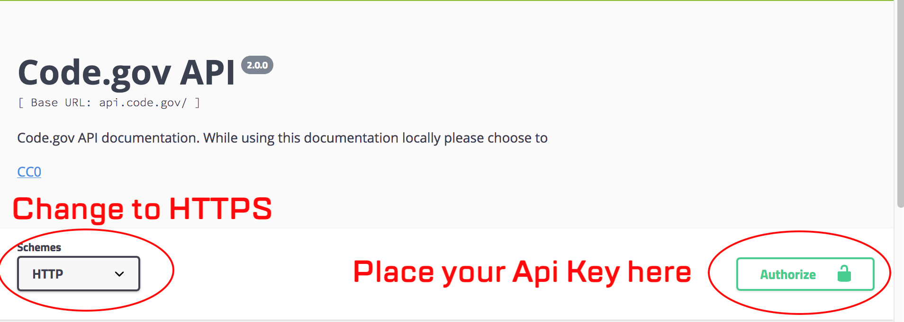

### Code.gov API Routes and Data Fields

We have extensive Swagger documentation where you can test our API. You can find them at [https://api.code.gov/docs](https://api.code.gov/docs).

Before you can actually try the docs, you need to obtain an API key. You can do so [here](/key.html). Once you obtain your API key, you can go to our Swagger documentation and use it by clicking on the __Authorize__ button located at the top right of the Swagger documentation.

{: height="300px" width="100%"}

Remember to change the __Schema__ to __HTTPS__. If this is not changed, you will receive an error when submitting the test request.
